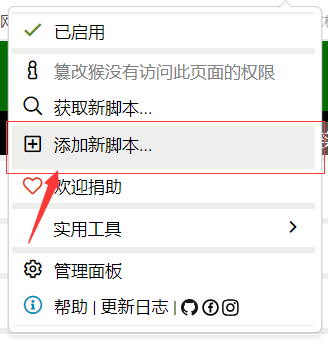
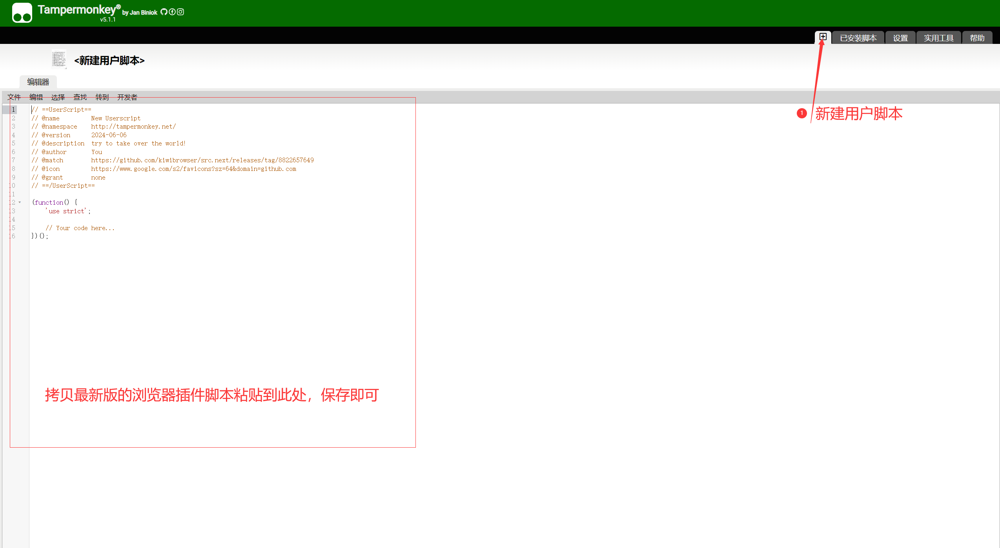
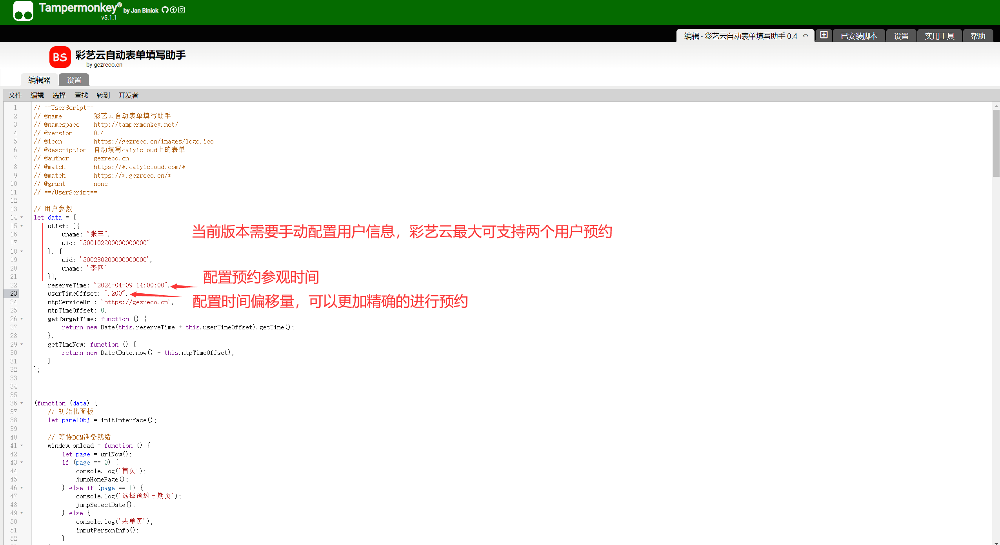

# 彩艺云自动抢号助手
## 一、浏览器插件
### 1、版本更新信息
| 版本 | 当前版本| 特性 |
| --- | ---| ---| 
| v0.1 | 版本过时，不推荐使用 | - |
| v0.2 | 版本过时，不推荐使用 | - |
| v0.3 | 只能填写一个人的观演信息 | 填写观演信息页面，修复有时不能获取“新增观演人”按钮的BUG |
| v0.31 | 测试版本 | 新增双人观演预约功能 |
| v0.4 | 当前版本 | 新增预约结束条件 |

### 2、浏览器插件使用方法
#### 2.1 下载浏览器：
推荐使用基于Chrome内核的浏览器
电脑端使用Chrome浏览器：https://www.google.cn/intl/zh-CN/chrome/downloads/
安卓手机端使用KiwiBrowser浏览器：https://github.com/kiwibrowser/src.next/releases

#### 2.2 安装Tampermonkey油猴脚本（暴力猴）：
请在谷歌浏览器插件中心下载Tampermonkey脚本，然后安装即可，Tampermonkey官方地址：https://tampermonkey.net/

#### 2.3 安装脚本：
打开油猴脚本，点击“添加新的脚本”


点击“新建用户脚本”，将脚本粘贴到编辑区域中按“Ctrl+S”保存即可


#### 2.4 配置个人信息：
需要在用户列表当中填写个人正确的姓名和身份证号码，否则将会影响预约结果，还需要手动设置预约参观时间，如果想要更加精确的进行预约，可以配置时间偏移量（0 - 999ms）


#### 2.5 安装完成后，刷新页面即可启用脚本使用。

## 二、nodejs端程序（暂时停止更新）
### 1、后端程序包含的附件
| 文件名 | 文件用途 | 备注 |
| --- | --- | --- |
| service.js | 后端程序主文件 | - |
| config.js | 后端程序配置文件 | - |
| package.json | - | - |

```bash
    # 1、安装项目依赖，在caiyicloud目录下
    npm install
    # 2、运行
    node service.js
```
<div style="background-color: yellow;display: inline-block; color: #c7254e;
    background-color: #f9f2f4; padding: 10px;border-radius: 8px">请在        <strong>config.js</strong> 中填写观演人信息，然后再运行后端程序</div>

### 2、前端程序包含的附件
| 文件名 | 文件用途 | 备注 |
| --- | --- | --- |
| web/index.html | 前端程序主页面 | - |
| web/index.css | 前端程序样式文件 | - |
| web/index.js | 前端程序js文件 | - |

<div style="background-color: yellow;display: inline-block; color: #c7254e;
    background-color: #f9f2f4; padding: 10px;border-radius: 8px">使用前请修改 <strong>index.js</strong> 中的url地址为后端接口的地址和端口号</div>

### 3、邮件服务
| 文件名 | 文件用途 | 备注 |
| --- | --- | --- |
| email_service/email_service.js | 提供邮件发送API | - |